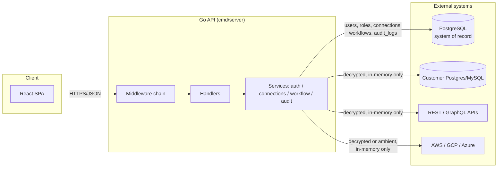
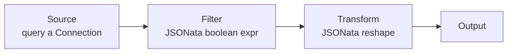

# Architecture

## Goals and constraints

Data Explorer connects to systems that hold real credentials and real data,
so the design optimizes for three things, in order: **security**,
**operability** (you can tell what it's doing and why), and **extensibility**
(new connector/node types are a small, isolated change). Raw throughput was
explicitly *not* the top priority - row limits and per-query timeouts trade
some performance for predictable resource usage.

## High-level components



The backend is a single Go binary. There is no queue, no cache, and no
separate worker process - workflow executions run synchronously inside the
HTTP request that triggered them, bounded by `workflow.MaxExecutionDuration`
(2 minutes). This is a deliberate simplicity trade-off for a first version;
see "Scaling beyond a single request" below for the extension point if that
stops being sufficient.

## Backend package layout

```
backend/
  cmd/server/           entrypoint: wiring, graceful shutdown
  db/migrations/        embedded SQL migrations (applied automatically on boot)
  pkg/                    standalone libraries - no internal/* imports, usable outside this app
    dataframe/             pandas-style Frame/Schema/Metadata (see "dataframe" below)
    httpclient/             HTTP client: pluggable auth + pagination (see "httpclient" below)
  internal/
    config/              env-based configuration, twelve-factor style
    domain/               shared entity structs (User, Connection, Workflow, ...)
    platform/
      logger/            slog-based structured logging + context propagation
      crypto/            Argon2id password hashing, AES-256-GCM secret encryption
      dbx/                pgx pool setup
      migrator/           embedded-SQL migration runner
      httpx/              JSON response/error helpers, request size guardrail
    auth/                 registration, login, JWT + refresh token issuance
    rbac/                  Principal type, permission constants, context helpers
    audit/                 append-only audit log writer + query API
    connections/            connection CRUD, secret encryption, connector interface, per-connection rate limit
      connectors/           postgres, mysql, rest, graphql, aws, gcp, azure implementations + shared auth/pagination/object-parsing glue
    catalog/                static integration catalog (prefill data for the connection form - see below)
    workflow/                DAG definition, topological execution engine, size/row guardrails, cron schedule parsing
      nodes/                  one executor per node type (source/transform/filter/join/aggregate/output)
    scheduler/               in-process poll loop that executes due cron-scheduled workflows
    observability/          Prometheus metrics registry
    api/
      middleware/           request id, recovery, security headers, rate limit, auth, rbac, access log
      handlers/               thin HTTP adapters over the service packages
      router.go               route table
```

Each service package (`auth`, `connections`, `workflow`, `audit`) follows the
same internal shape: a `Repository` (SQL access only, no business rules) and
a `Service` (business rules, calls the repository). Handlers never touch SQL
directly - they only call services. This keeps the authorization and
validation logic testable without an HTTP server or a database.

## Request lifecycle

Every API request passes through the same middleware chain
(`internal/api/router.go`), in order:

1. **RequestID** - assigns/propagates a correlation id (`X-Request-Id`).
2. **Recover** - converts a panic into a 500 instead of crashing the process.
3. **SecurityHeaders** - CSP, `X-Content-Type-Options`, `X-Frame-Options`, etc.
4. **CORS** - allow-list from `HTTP_ALLOWED_ORIGINS`.
5. **AccessLog** - one structured log line + a Prometheus observation per request.
6. **Authenticate** - parses `Authorization: Bearer <jwt>` if present, attaches
   an `rbac.Principal` to the request context. Does *not* reject anonymous
   requests (so `/healthz`, `/login` etc. can share the chain).
7. **Rate limiting** - a general per-IP limiter, plus a stricter one on
   `/auth/login|register|refresh`.
8. Route-specific **`RequirePermission(code)`** - the actual authorization
   check, one permission code per route (see `internal/rbac/rbac.go`).

Handlers that mutate state call `Handlers.recordAudit(...)` before returning,
which writes an `audit_logs` row with the actor, action, resource, outcome,
IP, user agent, and the request id (so an audit entry can be cross-referenced
with the structured log line for the same request).

## RBAC model

Permissions are fixed, fine-grained strings (`connections:write`,
`workflows:execute`, `audit:read`, ...) seeded once in
`db/migrations/0002_seed_rbac.sql`. Roles are just named bundles of
permissions; three system roles ship out of the box (`admin`, `editor`,
`viewer`), and custom roles/permission bundles can be added the same way.

A user's *flattened* permission set is resolved once, at login/refresh time,
and embedded directly in the JWT access token. This means every subsequent
request authorizes with a pure in-memory set lookup
(`internal/api/middleware/auth.go`) - no per-request database round trip.
The cost is that a role change takes effect on next login/refresh, not
instantly; access tokens are short-lived (15 minutes) by default specifically
to bound that staleness window.

## dataframe: the tabular data contract

`backend/pkg/dataframe` is a small, standalone, pandas-style tabular data
library with **zero imports from this module's `internal/*` packages** - it
doesn't know HTTP, SQL, or workflows exist. Every connector and every
workflow node speaks this one contract: a `*dataframe.Frame` in, a
`*dataframe.Frame` out. That's what lets `transform`, `filter`, `join`, and
`aggregate` compose freely regardless of whether the data originated from a
Postgres table, a paginated REST endpoint, or another node's output.

A `Frame` is columnar storage (`map[string]any` per column, index-aligned)
described by a `Schema` (ordered `Field{Name, Type, Nullable}`), plus a
`Metadata` struct carrying provenance: `SourceType`/`SourceID` (e.g.
`"postgres"` + a connection ID, or `"node:transform"` + a node ID),
`Lineage` (the chain of upstream frame names), `GeneratedAt`/`DurationMs`,
row/column counts, `Truncated`, and free-form `Warnings`. Column types are
inferred from Go values as rows are appended (`InferType`) and widen
automatically as new values arrive (`unifyType`: `int64` + `float64` →
`float64`; anything genuinely incompatible → `json`, never silently
stringified). The JSON wire format (`{schema, rows, meta}`) is what both the
ad-hoc "run query" API and every workflow execution response actually
return - see any `DataFrame` type in `frontend/src/api/types.ts`.

Built-in operations mirror their pandas/SQL equivalents: `Select`, `Rename`,
`Filter`, `Concat` (schema-unioning), `Join` (inner/left, with automatic
column-collision prefixing), `GroupBy`+`Agg` (sum/avg/count/min/max), and
`Describe` (per-column count/null-count/min/max/mean or string length
bounds). The workflow `join` and `aggregate` nodes
(`internal/workflow/nodes/{join,aggregate}.go`) are thin config/wiring
adapters over `dataframe.Join`/`Frame.GroupBy` - the actual algorithms live
entirely in the standalone package, not duplicated per node.

Two guardrails live at this layer specifically because they're about data
*integrity* rather than any one caller's business policy (see
`pkg/dataframe/guardrails.go`): `TruncateCells` clips any single string cell
over 256KB (applied centrally in `connections.Service.Query`, so it's
uniform across every connector), and `LimitRows` caps a frame's row count
and marks `Meta.Truncated` (applied per-node by the workflow engine - see
below).

## httpclient: the outbound HTTP layer

`backend/pkg/httpclient` is a second standalone package: a guardrailed,
pluggably-authenticated HTTP client the REST and GraphQL connectors are
built on. Its `Authenticator` interface covers the full spectrum of schemes
those APIs actually require:

| Scheme | How | 
| --- | --- |
| Basic / Bearer / API key | static header or query param |
| Digest (RFC 7616) | `RoundTripperAuthenticator`: sends unauthenticated, reads the 401 challenge, resends with a computed response - the one scheme that needs to see a response before it can authenticate |
| OAuth2 (client credentials / refresh token) | wraps `golang.org/x/oauth2`'s `TokenSource`, which caches and auto-refreshes |
| JWT (self-signed bearer) | mints and caches a short-lived HS256/RS256 JWT, re-signing shortly before expiry |
| Workload identity federation | generic RFC 8693 OAuth2 Token Exchange - the standards-based mechanism underlying AWS/GCP/Azure workload identity, so it isn't tied to one cloud SDK |
| Kerberos / SPNEGO | `github.com/jcmturner/gokrb5` (pure Go, no cgo/system Kerberos needed) |

Credentials for every scheme come from the connection's encrypted secret
map, never the plaintext `config` - see `internal/connections/connectors/httpauth.go`
for the mapping and exactly which secret key each scheme reads.

Pagination is a second first-class concern: a `Paginator` interface plus
five implementations (`OffsetLimitPaginator`, `PagePaginator`,
`CursorPaginator`, `LinkHeaderPaginator`, `GraphQLRelayPaginator`), driven by
`Client.DoPaginated`, which owns the `MaxPages` guardrail so every strategy
gets it for free - a misconfigured "next page" field that never goes empty
still stops after `DefaultMaxPages` (20, hard ceiling 500). The REST
connector maps a request's `PaginationSpec` to the right paginator; the
GraphQL connector only exposes `graphqlRelay` (Relay Cursor Connections:
`edges { node }` / `pageInfo { hasNextPage, endCursor }`), the de-facto
standard shape for GraphQL APIs.

Every request also gets the client-level guardrails regardless of auth or
pagination: a response size cap (25MB), a redirect cap (5), and bounded
retry with exponential backoff *and full jitter* (never a fixed interval,
which would let failing clients retry in lockstep) on 429/502/503/504.

## Connections and secrets

A `Connection` row splits into two parts:

- `config` (JSONB, plaintext) - non-sensitive settings: host, port, database
  name, base URL/endpoint, auth type and its non-secret parameters (token
  URL, scopes, SPN, ...).
- `secret_encrypted` (text, AES-256-GCM ciphertext) - credentials: password,
  API key, bearer token, OAuth2 client secret, JWT signing key, ...

`internal/connections.Service` is the *only* code path that decrypts a
secret, and it does so in-memory, immediately before handing it to a
`Connector.Test`/`Connector.Execute` call. Secrets are never included in any
API response, never logged, and never persisted anywhere in plaintext.
`Service.Query` also stamps connection provenance onto the returned frame's
metadata (the connector itself doesn't know its own connection's ID/name)
and applies the cross-connector `TruncateCells` guardrail before returning.

Seven connector types ship today: `postgres`, `mysql` (both via
`internal/connections/connectors/sqlguard.go`'s read-only statement guard),
`rest`, `graphql` (both via `pkg/httpclient`), and `aws`, `gcp`, `azure` (see
"Cloud provider connectors" below). Adding a new source type means
implementing the small `Connector` interface
(`internal/connections/connector.go` - `Test` + `Execute`, returning a
`*dataframe.Frame`) and registering it in `cmd/server/main.go` - see the
developer guide for a walkthrough.

## Cloud provider connectors

`aws`, `gcp`, and `azure` are one connector each, but each wraps several
distinct services behind a `config.service` discriminator, since "query AWS"
isn't one API:

| Type | `service` values | Client |
| --- | --- | --- |
| `aws` | `athena` (SQL), `cloudwatchLogs` (Logs Insights), `dynamodb` (Query/Scan), `s3` (object storage) | `aws-sdk-go-v2` |
| `gcp` | `bigquery` (SQL), `gcs` (object storage) | `cloud.google.com/go/{bigquery,storage}` |
| `azure` | `logAnalytics` (KQL), `blobStorage` (object storage) | `azure-sdk-for-go/sdk/{monitor/azquery,storage/azblob}` |

All three take a distinct query shape (SQL string, KQL string, log-group
names + time range, DynamoDB key/filter expressions, or bucket/key/prefix),
carried on `QuerySpec.Cloud` (`internal/connections/connector.go`'s
`CloudQuerySpec`) rather than overloading the SQL-shaped fields the
`postgres`/`mysql` connectors use.

Two implementation choices are shared across all three clouds specifically
because the same tension shows up in each SDK:

- **Ambient credentials by default.** Each connector's config accepts
  optional static credentials in the encrypted secret (AWS access
  key/secret/session token, a GCP service account key JSON blob, an Azure
  service-principal tenant/client/secret), but if none are supplied it falls
  back to the SDK's own default credential chain - `aws-sdk-go-v2`'s
  `config.LoadDefaultConfig` (IAM role), GCP's Application Default
  Credentials, `azidentity.NewDefaultAzureCredential`. This mirrors
  `pkg/httpclient`'s `workloadIdentity` auth scheme's philosophy at the
  cloud-SDK layer: prefer short-lived, non-stored credentials over a
  long-lived key sitting in the database, without forcing every deployment
  to configure one.
- **Async query polling, hidden behind one call.** Athena and CloudWatch
  Logs Insights don't have a synchronous "run and wait" API - both are
  start-then-poll (`StartQueryExecution`/`GetQueryExecution` and
  `StartQuery`/`GetQueryResults`). Each connector polls internally
  (`cloudguardrails.go`'s `AsyncQueryPollInterval`/`AsyncQueryMaxWait`, 500ms
  / 55s) so the caller's `Execute` contract stays synchronous like every
  other connector. BigQuery and Log Analytics are natively synchronous and
  need no polling.

Object storage (`s3`/`gcs`/`blobStorage`) shares one more piece:
`connectors/objectparse.go` infers CSV/JSON/NDJSON from the object key (or an
explicit `format` override) and parses it into rows, so the same code path
backs all three clouds' "read one object" mode; "list objects" mode (no key
given) returns a key/size/lastModified/etag frame instead. Object reads are
capped at `MaxObjectBytes` (50MB) - there's no streaming path yet, so a
larger object is a guardrail error, not a slow response.

## Integration catalog: prefilling, not proxying

`internal/catalog` is a small, first-party, static registry of ~20 well-known
integrations (GitHub, Stripe, Slack, Twilio, ...) used purely to prefill a
new `rest`/`graphql` connection's type, base URL/endpoint, auth type, and
non-secret auth config - it saves the "what's the base URL and auth scheme
for X" lookup, nothing more. Each `Entry` is expressed directly in terms of
`domain.ConnectionType` and the same `AuthType`/`AuthConfig` vocabulary
`connectors/httpauth.go` already speaks (see "Connections and secrets"
above), so a catalog pick maps onto fields the connection form already knows
how to render - there's no separate vocabulary to translate.

This is deliberately *not* a client of any live external registry: the data
in `internal/catalog/seed.go` is authored once, by hand, and
`Service.Search` filters it entirely in memory - there's nothing to cache,
nothing to rate-limit, and no new failure mode where connection creation
depends on a third party being up. `GET /api/v1/catalog` is read-only and
reuses `connections:read` rather than a new permission, since it's a
convenience layered on the existing connection-creation flow, not a new
resource class. Picking an entry never supplies a credential - the
connection form's secret fields are always left blank, with the entry's
`docsUrl` surfaced as a hint for where to go get one.

## Ad-hoc exploration

The Explore page (`frontend/src/pages/ExplorePage.tsx`) is a single-page
"pick a source, write a query, see a table" flow that sits outside the
workflow builder - not every question needs a saved pipeline. It supports
two sources:

- **A saved connection** - picks from the same list the Connections page
  shows, and queries it through the existing `Service.Query` path
  (`POST /api/v1/explore/query` with `connectionId`).
- **A temporary connection** - the same per-type config form
  (`ConnectionTypeConfigFields`, extracted out of `ConnectionFormModal` so
  both share one implementation) but nothing is ever persisted:
  `POST /api/v1/explore/query` with an inline `connection{type,config,secret}`
  goes straight to `connections.Service.QueryAdhoc`, which resolves a
  connector from the registry and calls `Execute` directly - no
  `Connection` row, no encryption, no repository involved. Because this
  path dials out to an arbitrary target with credentials the caller
  supplies live, it requires `connections:test` (the same permission that
  gates testing a saved connection) in addition to the route's baseline
  `connections:read` - checked in the handler itself, since which
  permission applies depends on which mode the request body uses, not the
  route.

Both modes return the same `dataframe.Frame` wire format used everywhere
else, so `DataFrameView` (schema badges, row/column counts, CSV/JSON export)
works identically regardless of source. The query-authoring half
(`QuerySpecFields` + `buildQuerySpec()`/`querySpec.ts`) is the same
extraction the ad-hoc "run query" modal on the Connections page uses, so
adding a query shape for a new connector type only has to happen once.

Two purely client-side conveniences ride on top, with no backend surface:
a **recent queries** list (`lib/exploreHistory.ts`, `localStorage`) scoped
to the saved-connection mode only - restoring a temporary connection's many
non-secret fields for marginal benefit wasn't worth the complexity, so that
mode isn't remembered - and **CSV/JSON export** on `DataFrameView` itself
(`lib/exportFrame.ts`), which benefits every screen that renders a frame,
not just Explore.

## Workflow execution engine

A workflow's `definition` is a small DAG: `{ nodes: [...], edges: [...] }`,
authored on the React Flow canvas and stored as-is (JSONB) so the frontend
round-trips node positions without any server-side transformation. Size is
guardrailed at validation time (`workflow.MaxNodes` = 200,
`workflow.MaxEdges` = 500).



`workflow.Engine.Run`:

1. Topologically sorts the nodes (Kahn's algorithm; a cycle is a validation
   error, rejected before execution ever starts).
2. Executes each node in order, gathering its declared inputs from upstream
   nodes' outputs (most nodes have one input; `join` has two, disambiguated
   by edge `targetHandle: "left" | "right"`).
3. Every node executor implements the same contract: `*dataframe.Frame` in,
   `*dataframe.Frame` out (see "dataframe" above) - this is what lets
   `transform`, `filter`, `join`, and `aggregate` compose freely regardless
   of where the data originated (SQL table, REST/GraphQL endpoint, or
   another node's output).
4. After each node, caps its output at `workflow.MaxRowsPerNode` (100,000
   rows) - defense in depth specifically for `join`, whose row count isn't
   bounded by any connector's row limit and can fan out well past either
   input's size on a low-selectivity key.
5. Stops at the first failing node; everything executed up to that point is
   still reported (row counts, durations) so a partially-broken pipeline is
   debuggable from the execution history, not just "it failed."

Every run is persisted as a `workflow_executions` row (status, duration,
per-node timings/row counts/errors) regardless of success or failure, which
is what backs the "Execution history" panel in the builder UI.

## Scheduled workflow execution

`internal/scheduler` is a single in-process polling loop (`PollInterval` =
15s), not a separate worker process or queue - the same "one Go binary"
simplicity this project defaults to everywhere else (see "Scaling beyond a
single request" below for where that stops being sufficient). A workflow
opts in with a standard 5-field cron expression
(`workflows.schedule_cron`/`schedule_enabled`); `workflow.Service.SetSchedule`
validates it (`ParseCronSchedule`, via `robfig/cron/v3`) and computes
`schedule_next_run` up front, so the scheduler's query is a cheap
`WHERE schedule_enabled AND schedule_next_run <= now()` against a partial
index, not a live cron evaluation on every tick.

A due workflow runs through the exact same `workflow.Service.Execute` path
as a manual "Run" click or an API call - same DAG engine, same
`MaxExecutionDuration` bound, same `workflow_executions` row - with one
difference: `TriggeredBy` is the sentinel string `"scheduler"` instead of a
user id, which is why `workflow_executions.triggered_by` is a plain string
column (like `audit_logs.actor_id`) rather than a foreign key to `users` -
a scheduled run has no acting user to attribute it to, and inventing a
synthetic system user just to satisfy a FK would show up in every user list
in the product for no real benefit.

## Observability

- **Structured logs** (`internal/platform/logger`): JSON by default, one line
  per request via the access-log middleware, carrying `request_id`, `actor`,
  `route`, `status`, `duration_ms`.
- **Metrics** (`internal/observability`): Prometheus counters/histograms for
  HTTP requests, connector query latency, and workflow execution outcomes,
  served at `/metrics`.
- **Audit trail** (`internal/audit`): a separate, append-only signal from logs
  - "who did what to which resource" - queryable via `/api/v1/audit-logs`
  and the Audit Log page, independent of log retention/rotation policy.
- **Health**: `/healthz` (liveness, no DB dependency) and `/readyz`
  (readiness, pings the database) for orchestrator probes.

`request_id` is the thread that ties a log line, a metric label (route), and
an audit entry's metadata back to the same originating request.

## Frontend

A standard Vite + React + TypeScript SPA:

- `src/api/` - typed fetch wrappers (axios) per resource, plus `client.ts`
  which centralizes auth header injection and silent access-token refresh.
- `src/state/` - small Zustand stores: `authStore` (session, permissions),
  `themeStore` (light/dark/system, persisted to `localStorage`), and
  `sidebarStore` (collapsed/expanded, persisted the same way).
- `src/index.css` - the design **tokens**: CSS custom properties for color,
  spacing, radius, and the two fixed layout dimensions (sidebar width,
  topbar height). The palette is deliberately near-monochrome - every
  structural color (surfaces, borders, text) and the accent itself are
  grayscale (accent = ink: near-black on light, near-white on dark); the
  three status hues (success/warning/danger) are the only color left in the
  system, and `Badge` (below) confines them to a small dot rather than a
  filled chip. Light/dark/system all resolve to the same variable names, so
  the whole app re-themes by swapping one attribute (`data-theme` on
  `<html>`) with zero per-component branching.
- `src/components/ui/` - the component **library**: `Button`, `IconButton`,
  `Field`, `Input`, `Select`, `Textarea`, `Badge`, `Card`/`CardHeader`/
  `CardBody`, `StatTile`. These are typed wrappers around the class names in
  `src/styles/app.css` (`.btn`, `.input`, `.field`, ...), not a parallel
  styling system - a raw `className="btn"` and a `<Button>` render
  identically, so partially-migrated and fully-migrated screens never look
  inconsistent. New UI should use these instead of raw class strings; see
  the developer guide for the convention.
- `src/components/` - shared UI beyond the primitives above: layout shell
  (`layout/AppShell.tsx`, `Sidebar.tsx` - collapsible, with a user/logout
  footer, `Topbar.tsx` - shows the current section title), `DataTable`,
  `Modal`, `PermissionGate`. `DataFrameView` renders a dataframe's schema
  (typed column badges), rows, and metadata (row/col counts, timing,
  source, lineage, truncation, warnings) as one unit plus a CSV/JSON export
  action (`lib/exportFrame.ts`), and `PaginationFields`/`QuerySpecFields`
  are the pagination/query-shape config forms shared across the ad-hoc query
  modal, the Explore page, and the workflow source node.
- `src/lib/` - cross-page logic with no UI of its own: `connectionFields.ts`
  (the `useConnectionFields` hook backing both `ConnectionFormModal` and
  Explore's temporary-connection form), `querySpec.ts` (the query-authoring
  form state + `buildQuerySpec`/`summarizeQuery`), `exportFrame.ts`,
  `exploreHistory.ts`, `permissions.ts`.
- `src/pages/connections/AuthTypeFields.tsx` - the per-auth-type config form
  (10 schemes) shared by the connection create/edit modal, mirroring
  `pkg/httpclient`'s `Authenticator` matrix field-for-field.
- `src/pages/workflow/` - the React Flow canvas, one custom node renderer,
  and a type-specific configuration panel per node type.

Data fetching goes through TanStack Query for caching/invalidation; there is
no global Redux-style store for server data on purpose - the two Zustand
stores hold only genuinely client-side state (session, theme).

## Scaling beyond a single request

Two extension points are intentionally left as clean seams rather than
built out speculatively:

- **Async workflow execution**: `workflow.Service.Execute` currently runs
  inline, whether triggered by an HTTP request or by `internal/scheduler`'s
  background goroutine. If pipelines grow beyond what fits in one request's
  (or one poll tick's) budget, the natural next step is to have this method
  enqueue a job (e.g. to a Postgres-backed queue table or a proper broker)
  and have the API return immediately with the `workflow_executions` row in
  `running` state, which the frontend already polls for - the scheduler
  would enqueue the same way rather than executing directly.
- **Connection pooling per external target**: connectors currently open a
  fresh connection per `Test`/`Execute` call for isolation simplicity. A
  per-connection pool (keyed by connection ID) would reduce handshake
  overhead for high-frequency queries at the cost of managing pool lifecycle
  across connection edits/deletes.
