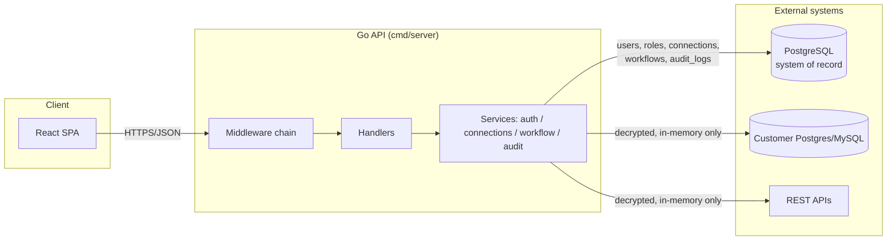
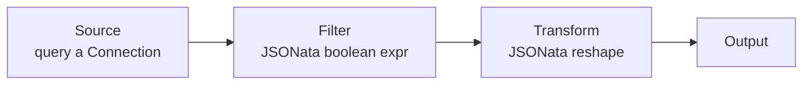

# Architecture

## Goals and constraints

Data Explorer connects to systems that hold real credentials and real data,
so the design optimizes for three things, in order: **security**,
**operability** (you can tell what it's doing and why), and **extensibility**
(new connector/node types are a small, isolated change). Raw throughput was
explicitly *not* the top priority - row limits and per-query timeouts trade
some performance for predictable resource usage.

## High-level components



The backend is a single Go binary. There is no queue, no cache, and no
separate worker process - workflow executions run synchronously inside the
HTTP request that triggered them, bounded by `workflow.MaxExecutionDuration`
(2 minutes). This is a deliberate simplicity trade-off for a first version;
see "Scaling beyond a single request" below for the extension point if that
stops being sufficient.

## Backend package layout

```
backend/
  cmd/server/           entrypoint: wiring, graceful shutdown
  db/migrations/        embedded SQL migrations (applied automatically on boot)
  internal/
    config/              env-based configuration, twelve-factor style
    domain/               shared entity structs (User, Connection, Workflow, ...)
    platform/
      logger/            slog-based structured logging + context propagation
      crypto/            Argon2id password hashing, AES-256-GCM secret encryption
      dbx/                pgx pool setup
      migrator/           embedded-SQL migration runner
      httpx/              JSON response/error helpers
    auth/                 registration, login, JWT + refresh token issuance
    rbac/                  Principal type, permission constants, context helpers
    audit/                 append-only audit log writer + query API
    connections/            connection CRUD, secret encryption, connector interface
      connectors/           postgres, mysql, rest implementations
    workflow/                DAG definition, topological execution engine
      nodes/                  one executor per node type (source/transform/filter/join/aggregate/output)
    observability/          Prometheus metrics registry
    api/
      middleware/           request id, recovery, security headers, rate limit, auth, rbac, access log
      handlers/               thin HTTP adapters over the service packages
      router.go               route table
```

Each service package (`auth`, `connections`, `workflow`, `audit`) follows the
same internal shape: a `Repository` (SQL access only, no business rules) and
a `Service` (business rules, calls the repository). Handlers never touch SQL
directly - they only call services. This keeps the authorization and
validation logic testable without an HTTP server or a database.

## Request lifecycle

Every API request passes through the same middleware chain
(`internal/api/router.go`), in order:

1. **RequestID** - assigns/propagates a correlation id (`X-Request-Id`).
2. **Recover** - converts a panic into a 500 instead of crashing the process.
3. **SecurityHeaders** - CSP, `X-Content-Type-Options`, `X-Frame-Options`, etc.
4. **CORS** - allow-list from `HTTP_ALLOWED_ORIGINS`.
5. **AccessLog** - one structured log line + a Prometheus observation per request.
6. **Authenticate** - parses `Authorization: Bearer <jwt>` if present, attaches
   an `rbac.Principal` to the request context. Does *not* reject anonymous
   requests (so `/healthz`, `/login` etc. can share the chain).
7. **Rate limiting** - a general per-IP limiter, plus a stricter one on
   `/auth/login|register|refresh`.
8. Route-specific **`RequirePermission(code)`** - the actual authorization
   check, one permission code per route (see `internal/rbac/rbac.go`).

Handlers that mutate state call `Handlers.recordAudit(...)` before returning,
which writes an `audit_logs` row with the actor, action, resource, outcome,
IP, user agent, and the request id (so an audit entry can be cross-referenced
with the structured log line for the same request).

## RBAC model

Permissions are fixed, fine-grained strings (`connections:write`,
`workflows:execute`, `audit:read`, ...) seeded once in
`db/migrations/0002_seed_rbac.sql`. Roles are just named bundles of
permissions; three system roles ship out of the box (`admin`, `editor`,
`viewer`), and custom roles/permission bundles can be added the same way.

A user's *flattened* permission set is resolved once, at login/refresh time,
and embedded directly in the JWT access token. This means every subsequent
request authorizes with a pure in-memory set lookup
(`internal/api/middleware/auth.go`) - no per-request database round trip.
The cost is that a role change takes effect on next login/refresh, not
instantly; access tokens are short-lived (15 minutes) by default specifically
to bound that staleness window.

## Connections and secrets

A `Connection` row splits into two parts:

- `config` (JSONB, plaintext) - non-sensitive settings: host, port, database
  name, base URL, auth type.
- `secret_encrypted` (text, AES-256-GCM ciphertext) - credentials: password,
  API key, bearer token.

`internal/connections.Service` is the *only* code path that decrypts a
secret, and it does so in-memory, immediately before handing it to a
`Connector.Test`/`Connector.Execute` call. Secrets are never included in any
API response, never logged, and never persisted anywhere in plaintext.

Adding a new source type means implementing the small `Connector` interface
(`internal/connections/connector.go`) and registering it in
`cmd/server/main.go` - see the developer guide for a walkthrough.

## Workflow execution engine

A workflow's `definition` is a small DAG: `{ nodes: [...], edges: [...] }`,
authored on the React Flow canvas and stored as-is (JSONB) so the frontend
round-trips node positions without any server-side transformation.



`workflow.Engine.Run`:

1. Topologically sorts the nodes (Kahn's algorithm; a cycle is a validation
   error, rejected before execution ever starts).
2. Executes each node in order, gathering its declared inputs from upstream
   nodes' outputs (most nodes have one input; `join` has two, disambiguated
   by edge `targetHandle: "left" | "right"`).
3. Every node executor implements the same contract: tabular in
   (`connections.QueryResult`), tabular out. This is what lets `transform`,
   `filter`, `join`, and `aggregate` compose freely regardless of where the
   data originated (SQL table, REST endpoint, or another node's output).
4. Stops at the first failing node; everything executed up to that point is
   still reported (row counts, durations) so a partially-broken pipeline is
   debuggable from the execution history, not just "it failed."

Every run is persisted as a `workflow_executions` row (status, duration,
per-node timings/row counts/errors) regardless of success or failure, which
is what backs the "Execution history" panel in the builder UI.

## Observability

- **Structured logs** (`internal/platform/logger`): JSON by default, one line
  per request via the access-log middleware, carrying `request_id`, `actor`,
  `route`, `status`, `duration_ms`.
- **Metrics** (`internal/observability`): Prometheus counters/histograms for
  HTTP requests, connector query latency, and workflow execution outcomes,
  served at `/metrics`.
- **Audit trail** (`internal/audit`): a separate, append-only signal from logs
  - "who did what to which resource" - queryable via `/api/v1/audit-logs`
  and the Audit Log page, independent of log retention/rotation policy.
- **Health**: `/healthz` (liveness, no DB dependency) and `/readyz`
  (readiness, pings the database) for orchestrator probes.

`request_id` is the thread that ties a log line, a metric label (route), and
an audit entry's metadata back to the same originating request.

## Frontend

A standard Vite + React + TypeScript SPA:

- `src/api/` - typed fetch wrappers (axios) per resource, plus `client.ts`
  which centralizes auth header injection and silent access-token refresh.
- `src/state/` - two small Zustand stores: `authStore` (session, permissions)
  and `themeStore` (light/dark/system, persisted to `localStorage`).
- `src/components/` - shared UI (layout shell, data table, modal, permission
  gate) with a small hand-rolled CSS design system (`src/styles/app.css`)
  built on CSS custom properties, so the whole app re-themes by swapping one
  attribute (`data-theme` on `<html>`).
- `src/pages/workflow/` - the React Flow canvas, one custom node renderer,
  and a type-specific configuration panel per node type.

Data fetching goes through TanStack Query for caching/invalidation; there is
no global Redux-style store for server data on purpose - the two Zustand
stores hold only genuinely client-side state (session, theme).

## Scaling beyond a single request

Two extension points are intentionally left as clean seams rather than
built out speculatively:

- **Async workflow execution**: `workflow.Service.Execute` currently runs
  inline. If pipelines grow beyond what fits in one HTTP request's budget,
  the natural next step is to have this method enqueue a job (e.g. to a
  Postgres-backed queue table or a proper broker) and have the API return
  immediately with the `workflow_executions` row in `running` state, which
  the frontend already polls for.
- **Connection pooling per external target**: connectors currently open a
  fresh connection per `Test`/`Execute` call for isolation simplicity. A
  per-connection pool (keyed by connection ID) would reduce handshake
  overhead for high-frequency queries at the cost of managing pool lifecycle
  across connection edits/deletes.
